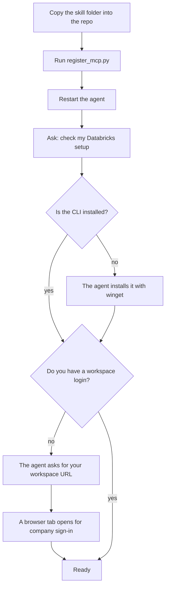
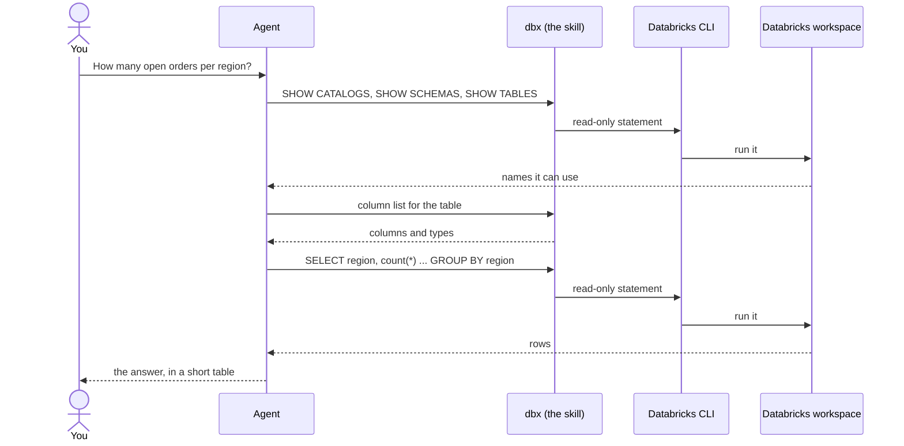
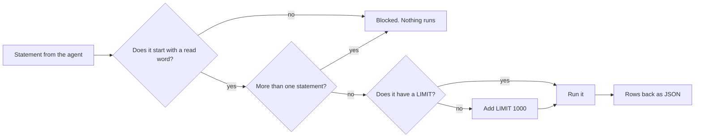
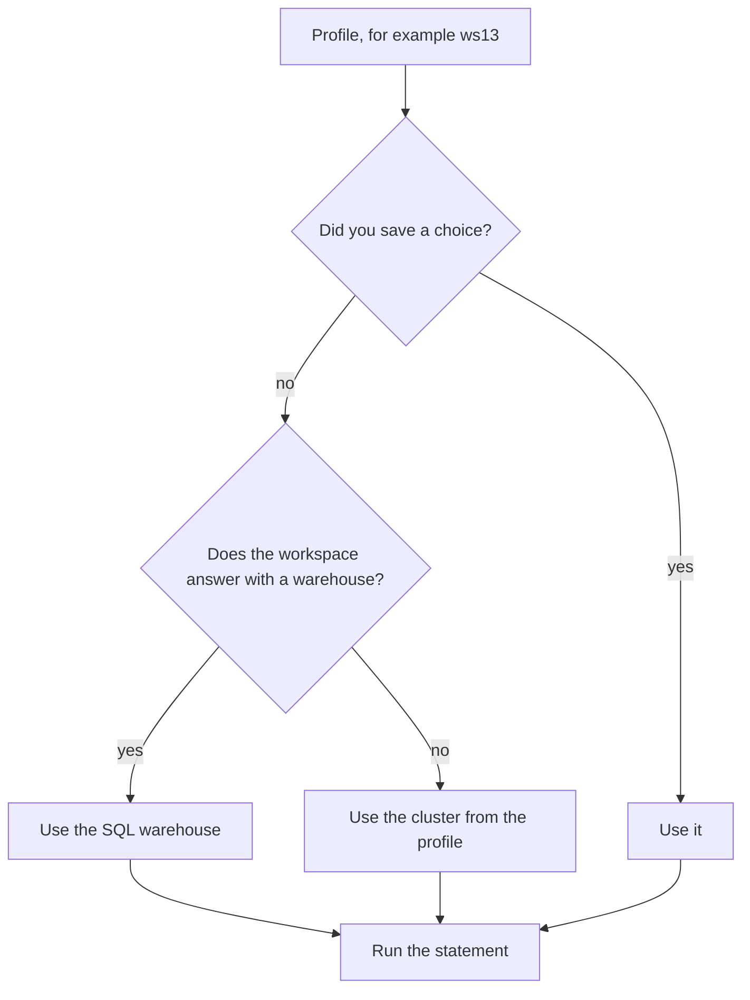

# How to use the Databricks skill

This guide is for a person, not for the agent. The agent reads `SKILL.md`.

You ask your coding agent a question about company data. The agent reads Databricks for you.
You never write SQL, and you never handle a token.

## What the skill gives your agent

| Tool | What it does |
|---|---|
| `fde-databricks-setup` | Checks the Databricks CLI and every workspace login. Installs the CLI with `fix: true`. |
| `fde-databricks-login` | Opens a browser tab for company sign-in (SSO). |
| `fde-databricks-sql` | Runs one read-only statement and returns rows. |
| `fde-databricks-schema` | Lists the columns of a table. |
| `fde-databricks-compute` | Lists SQL warehouses and clusters, or saves which one to use. |

## Install it once

You need the repo that holds the MCP server (`mcp/mcp_tools.yaml`). Run these lines from the repo root, in PowerShell.

```powershell
Invoke-WebRequest https://github.com/eminbayrak/ai-architecture/archive/refs/heads/add-databricks-skill.zip -OutFile $env:TEMP\dbxskill.zip -UseBasicParsing
Expand-Archive $env:TEMP\dbxskill.zip $env:TEMP\dbxskill -Force
Copy-Item $env:TEMP\dbxskill\ai-architecture-add-databricks-skill\skills\databricks knowledge-base\domains\fde\skills -Recurse -Force
.venv\Scripts\python.exe knowledge-base\domains\fde\skills\databricks\scripts\register_mcp.py mcp\mcp_tools.yaml
```

Then restart your agent, so it loads the new tools.



## First run

1. Ask your agent: "check my Databricks setup".
2. Answer the questions it asks. It needs your workspace URL and a short name, for example `ws13`.
3. Finish the sign-in in the browser tab that opens.
4. Ask your data question.

The CLI keeps your login in `~/.databrickscfg` and refreshes it on its own. You sign in again only when your company session ends.

## Ask a question in plain English

Say what you want, not how to get it.

- "How many open orders does each region have this month?"
- "Show me the newest 20 rows of the shipments table."
- "Which columns does the customer table have?"

The agent turns your question into SQL in three steps. It looks up the catalogs, schemas and tables. It reads the columns of the table it picked. Then it writes one SELECT.



## What the skill blocks

The skill runs read statements only: `SELECT`, `WITH`, `VALUES`, `SHOW`, `DESCRIBE` and `EXPLAIN`.
It rejects everything else before it reaches Databricks. It also rejects a second statement on the same call.



So a request like "delete the old rows" fails by design. The skill reads data. It never changes data.

## Where your query runs

Each workspace has compute: a SQL warehouse, a cluster, or both. The skill picks one and remembers it.



Ask the agent to "list Databricks compute" to see the options. Ask it to save one if you want a specific warehouse or cluster. A stopped cluster starts on the first query, which takes a few minutes.

## Several workspaces

Each workspace gets a short profile name, for example `ws11`, `ws13`, `ws14`. Name the one you want in your question: "in ws14, how many active users?". With one workspace, say nothing and the skill uses it.

## Check that it works

```powershell
.venv\Scripts\python.exe knowledge-base\domains\fde\skills\databricks\tests\live_mcp_check.py mcp\server.py mcp\mcp_tools.yaml ws13
```

The check calls every tool through the MCP server and prints PASS or FAIL per step. It prints counts only, never hosts, IDs, table names or values.

## If something goes wrong

| What you see | What to do |
|---|---|
| "Databricks CLI not found" | Ask the agent to run the setup with `fix`. It installs the CLI with `winget`. |
| "No workspace set up" | Ask the agent to log you in. Have your workspace URL ready. |
| The workspace shows `NEEDS LOGIN` | Your session ended. Ask the agent to log you in again. |
| "Blocked: ... is not a read statement" | The skill refuses writes. This is the guard, not a bug. |
| A query takes minutes on the first call | A stopped cluster is starting. Later queries are fast. |
| The agent cannot find the tools | Restart the agent. The MCP server loads `mcp_tools.yaml` at start. |

## Privacy

- The skill sends your SQL to your own Databricks workspace, and nowhere else.
- It never prints your token. The CLI holds the login.
- `setup` hides workspace hosts and compute IDs. Add `--details` in the terminal when you need them.
