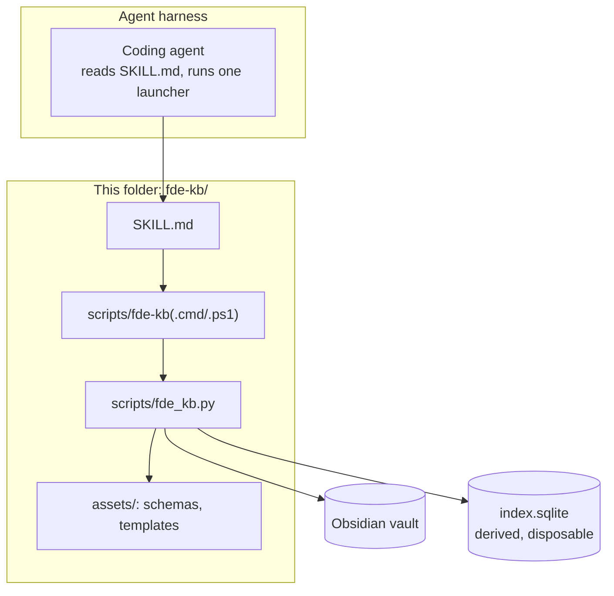
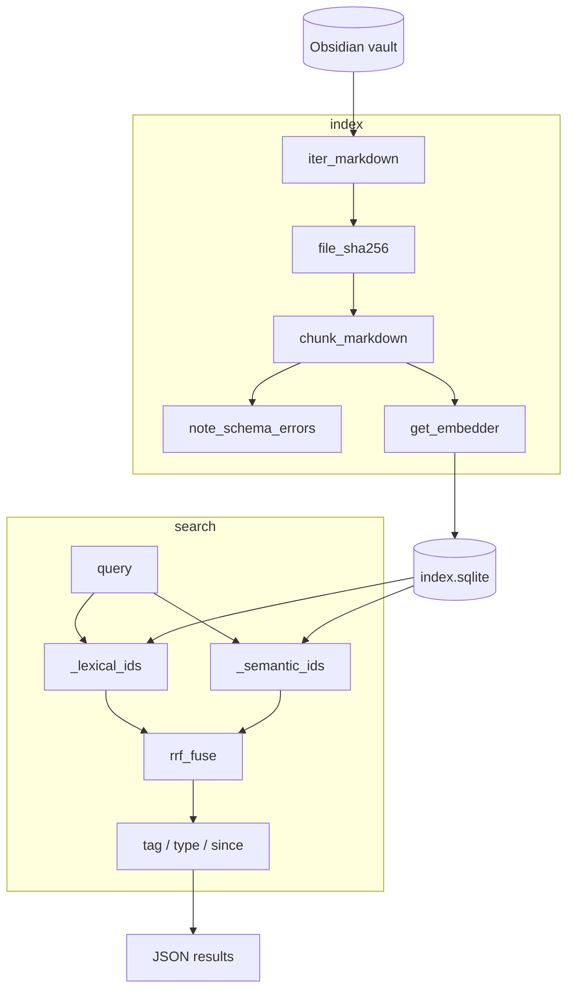
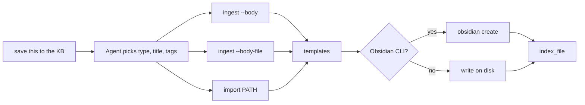
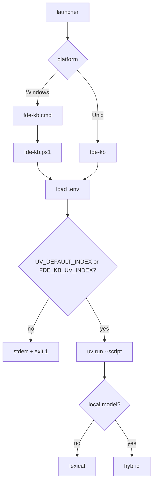

# fde-kb architecture

How this skill works. Diagram nodes are clickable and open the implementing
file. If your viewer does not support clickable Mermaid, use the
[file index](#file-index).

This folder is the whole skill. Copy `fde-kb/` into `.poolside/skills/fde-kb`
(or your harness equivalent). Nothing here depends on a parent repo.

## Overview

Local search over an Obsidian vault. The vault is the source of truth. A local
SQLite file is derived memory: FTS5 (BM25) always, plus sqlite-vec when a local
Model2Vec snapshot is present. The skill makes zero LLM calls. Note text is not
sent to any remote model API.

## Retrieval

The SQLite file is disposable: delete it and `index` rebuilds it. Two retrievers
run over the same database; rankings are merged with Reciprocal Rank Fusion.

Keyword search wins on exact terms. Vector search wins on paraphrase. RRF only
uses ranks, so the two score scales do not need calibration. Without a local
model snapshot, search stays lexical and reports `"mode": "lexical"` with
`"degraded": true`.

## Writing notes

The agent picks type, title, and tags. The skill renders a schema-valid note.
People do not hand-edit frontmatter.

`--body` is limited by the OS command-line length (8191 characters on Windows
`cmd`). Longer text uses `--body-file` or stdin.

## Launchers

Set `FDE_KB_UV_INDEX` (or `UV_DEFAULT_INDEX`) to your package index before first
run. Development only: `FDE_KB_ALLOW_PUBLIC_INDEX=1`.

## Index location

`chunks.text` stores note text in the SQLite file. Default paths:

- Windows: `%LOCALAPPDATA%\fde-kb\index.sqlite`
- macOS / Linux: `~/.cache/fde-kb/index.sqlite`

Override with `FDE_KB_DB` if you want the index next to the vault.

## Design choices

| Choice | Why |
|---|---|
| SQLite | One file, no service |
| Static embeddings | Small, CPU-only |
| Weights not in this folder | Keep the skill copy small and reviewable |
| RRF over raw scores | No score calibration |
| Zero LLM calls in the skill | Leaf tool; rewriting stays in the agent |
| Chunk on headings | Matches how notes are written |

## File index

| Area | File |
|---|---|
| Agent instructions | [SKILL.md](../SKILL.md) |
| Operator README | [README.md](../README.md) |
| Implementation | [scripts/fde_kb.py](../scripts/fde_kb.py) |
| Launchers | [fde-kb](../scripts/fde-kb) · [fde-kb.cmd](../scripts/fde-kb.cmd) · [fde-kb.ps1](../scripts/fde-kb.ps1) |
| Note schema | [note.schema.json](../assets/schemas/note.schema.json) |
| Golden schema | [golden-case.schema.json](../assets/schemas/golden-case.schema.json) |
| Templates | [assets/templates/](../assets/templates/) |
| Model placement | [assets/models/README.md](../assets/models/README.md) |
| Test vault | [scripts/make-test-vault.py](../scripts/make-test-vault.py) |
