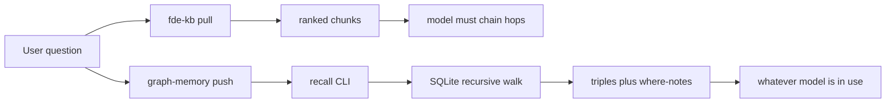

# graph-memory architecture

Two retrieval paths live in this kit. They do not share an index.

## Graph build

`extraction/*.json` → `build_graph.py` → `graph.db`

- Identity: `uuid5(NAMESPACE_OID, "{type}:{normalised_name}")`
- Tables: `entities`, `relations`, `aliases`
- First write wins on `INSERT OR IGNORE` (sorted filenames)
- Conditions (amounts, dates) live on entity descriptions, not edges

The build reads shipped JSON. It does not call a model.

## Recall

1. Seed: entity name or alias appears as a word in the question.
2. Walk k=3 hops, undirected, on `relations`.
3. Return top 8 triples plus `where:` notes.
4. No seeds → `(no memory matches for this prompt)`

`recall.py` makes zero model calls.

## Compare

`compare` wraps `corpus-before` as schema-valid fde-kb playbooks, indexes them lexically, and searches the same question. That is the pull side. The push side is `recall` on the modelled graph.

## File index

| Area | File |
|---|---|
| Agent instructions | [SKILL.md](../SKILL.md) |
| Operator README | [README.md](../README.md) |
| Schema | [schema.sql](../src/schema.sql) |
| Build | [build_graph.py](../src/build_graph.py) |
| Recall | [recall.py](../src/recall.py) |
| CLI | [graph_memory.py](../scripts/graph_memory.py) |
| Optional hook | [recall_hook.py](../src/recall_hook.py) |
