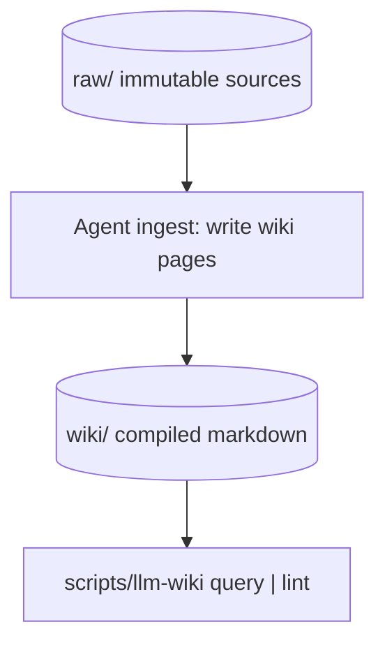

# llm-wiki architecture

Three layers, no shared runtime with fde-kb or graph-memory.

- `query` is lexical over page titles and bodies. `index.md` and `log.md` are skipped so the catalog cannot leak every name.
- `lint` checks wikilinks and orphans. It does not judge prose.
- `compile-extracts` is an optional projector for graph-memory-shaped JSON. It is not required to install graph-memory.

Env overrides for tests: `LLM_WIKI_ROOT`, `LLM_WIKI_RAW`, `LLM_WIKI_WIKI`.
Module names are prefixed `llm_wiki_*` so a full pytest run cannot import graph-memory's `paths` by mistake.
